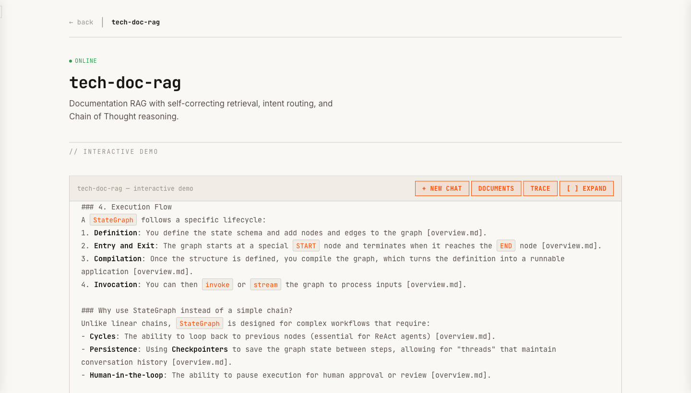
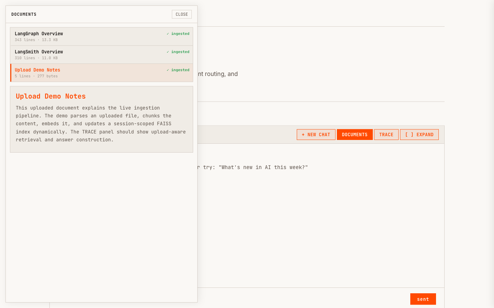
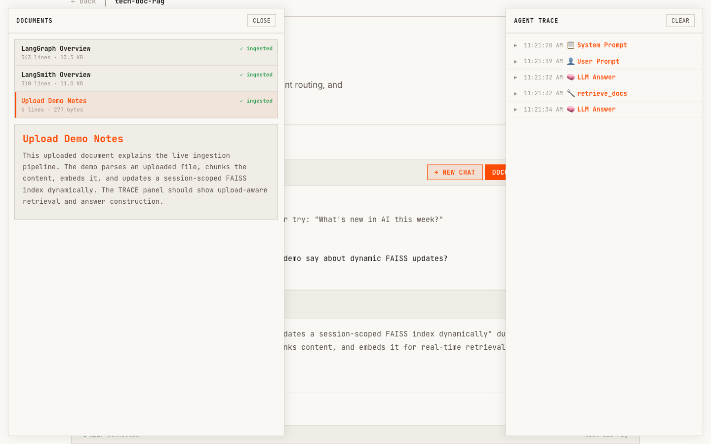

# tech-doc-rag

Viewer-friendly documentation RAG agent that demonstrates the core architecture behind a production agentic retrieval app: LangGraph graph design, Python tool execution, search integration, SSE streaming, trace visibility, local document embeddings, and session-scoped upload retrieval.

The project started with LangGraph for graph design, then added Python execution and DuckDuckGo search/fetch tools so the agent can choose between retrieval, current web context, URL evidence, and calculations. Tracing was built later and integrated into the graph with AI assistance, so each run exposes the agent's prompts, tool decisions, tool results, and final answer path. The frontend viewer is fully AI-built as a static HTML/CSS/JavaScript interface served by FastAPI.

The agent answers questions from bundled LangGraph/tracing documentation, can search the web when current information is useful, can fetch result URLs for supporting evidence, can run restricted Python calculations, and can answer against session-uploaded Markdown, text, PDF, or DOCX files.

## Live Demo

- App: <https://vanmai40-agentic-rag.hf.space/tech-doc.html>
- Health check: <https://vanmai40-agentic-rag.hf.space/health>
- Use the App link above for a quick browser demo with chat, upload, streaming, and TRACE visibility.

This project is hosted live so reviewers can test the actual behavior, not just read code or look at screenshots. That is intentional: many portfolio projects stop at a repository, while this one exposes the running viewer, SSE stream, trace timeline, document retrieval, and upload flow for hands-on evaluation.

The Hugging Face Space is public for portfolio review. Source code is visible, while runtime API keys are stored as Hugging Face Space secrets and are not committed to this repository.



## Upload Ingestion + Dynamic FAISS

The live viewer supports temporary document uploads for Markdown, text, PDF, and DOCX files. An uploaded file is parsed, chunked, embedded, and merged into a session-scoped FAISS index while the app is running. That means the reviewer can upload a document and immediately ask retrieval questions against it without rebuilding the bundled documentation index.



## Built-In Tracing

TRACE is built into the app, not added as an external screenshot. Each live request can show the prompt, LLM decisions, tool calls, retrieval steps, upload-aware document matches, and final answer construction in the side panel while the SSE chat response streams.



## What This Project Shows

- LangGraph-first graph design using a ReAct loop with explicit agent, tool-execution, and answer-extraction nodes
- Python tool integration for restricted calculations inside the same graph loop
- DuckDuckGo search and URL-fetch tools for current information and supporting evidence
- Upload ingestion pipeline that parses, chunks, embeds, and adds session documents to FAISS dynamically
- Server-sent event streaming for token output and tool progress
- AI-assisted TRACE integration inside the graph so viewers can inspect routing, retrieval, web search, uploads, and final-answer steps
- Fully AI-built frontend viewer with chat, upload controls, streaming output, and a trace panel
- Local document embedding with Hugging Face sentence transformers and FAISS
- Public-demo hardening for upload size, file type, trace redaction, and error handling
- Hugging Face Spaces deployment from the repo-root Dockerfile

## Architecture

```text
Browser viewer
  - chat composer
  - upload control
  - streaming answer area
  - TRACE timeline
        |
        | HTTP JSON + SSE stream
        v
FastAPI app
  - serves the static viewer
  - validates uploads
  - emits trace events
        |
        v
LangGraph ReAct loop
  - agent node chooses the next action
  - tool node executes retrieval/search/fetch/python
        |
        +-- retrieve_docs -> bundled FAISS index + dynamic uploaded-session FAISS index
        +-- search_web    -> DDG web results
        +-- fetch_url      -> secondary URL fetch from search results
        +-- run_python     -> restricted Python calculations
        v
OpenAI-compatible LLM endpoint
```

The graph loops between an LLM-powered agent node and a tool executor until the model returns a final answer. The first design pass focused on the LangGraph structure; Python execution, DDG search, URL fetch, document retrieval, and upload-aware FAISS retrieval were then exposed as graph tools. TRACE was built and integrated into the graph with AI assistance, turning graph state into visible SSE events so a reviewer can see what the agent is doing instead of treating the response as a black box. Uploaded documents go through the same retrieval tool after the app builds a temporary session FAISS index from the uploaded content. The same backend serves the fully AI-built browser UI, non-streaming chat, streaming chat, document listing, upload, and reset endpoints.

## Current Stack

| Layer | Current choice |
|---|---|
| Agent orchestration | LangGraph ReAct loop |
| API | FastAPI + Uvicorn |
| Frontend | Fully AI-built static HTML served by FastAPI |
| LLM | OpenAI-compatible chat endpoint |
| Embeddings | Hugging Face `sentence-transformers/all-MiniLM-L6-v2` by default |
| Vector store | Local FAISS index |
| Web search | DuckDuckGo/DDG HTML search |
| Tracing | In-app TRACE panel and SSE trace events |
| Deployment | Hugging Face Spaces Docker app |

Pinecone, Tavily, and LangSmith accounts are not required for the current implementation.

## Deployment Cost

| Cost area | Current setup | Cost |
|---|---|---:|
| Hugging Face hosting | Public HF Space using the free CPU tier | `$0` |
| LLM usage | Demo runs through the configured OpenAI-compatible endpoint with no paid usage billed for this public demo setup | `$0` |
| Search API | DuckDuckGo/DDG HTML search, no paid Tavily key required | `$0` |
| Overall project deployment | Hosting + current demo LLM/search setup | `$0` |


## Key Files

```text
tech-doc-rag/
├── src/
│   ├── graph.py       # LangGraph ReAct loop and routing
│   ├── tools.py       # retrieval, web search, URL fetch, Python, uploads
│   ├── prompts.py     # ReAct system prompt and answer rules
│   ├── ingest.py      # builds the local FAISS index
│   ├── config.py      # Pydantic settings from the repo-root .env
│   └── main.py        # terminal chat entry point
├── data/              # bundled markdown documentation corpus
├── tests/             # graph, upload, endpoint, and regression tests
└── .faiss_index/      # local vector index used by the deployed app
```

The production container is built from the repository root, not this subdirectory. The root `Dockerfile` copies `api/`, `frontend/`, `tech-doc-rag/src/`, `tech-doc-rag/data/`, and `tech-doc-rag/.faiss_index/` into the image.

## Try These In The Live Demo

```text
How does StateGraph work in LangGraph?
How can the TRACE panel help evaluate a workflow?
Upload a document and ask: what did the uploaded notes say?
After uploading, ask: how did the dynamic FAISS update affect retrieval?
What changed recently in LangGraph?
What is 17 * 23?
```
